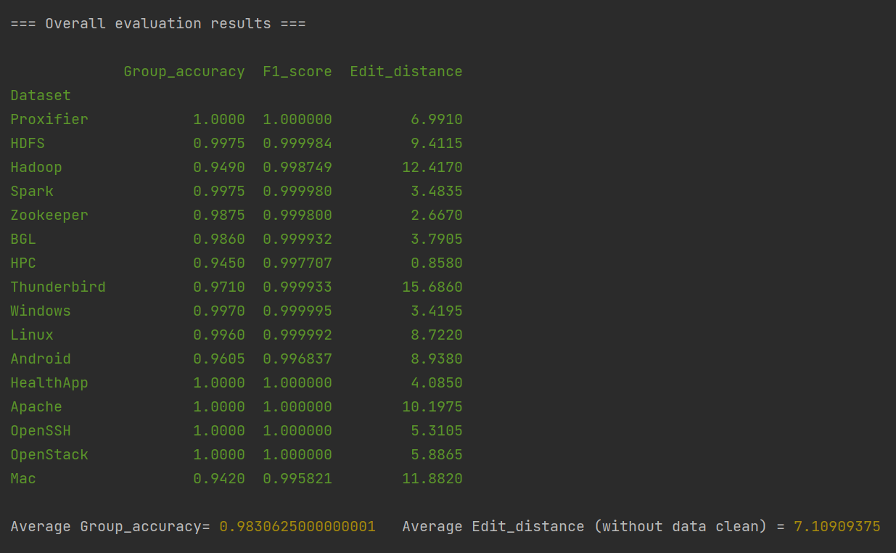

# Brain
## Brain: Log Parsing with Bidirectional Parallel Tree
IEEE Transaction on Severice Computing

###·ABSTRACT

Automated log analysis can facilitate failure diagnosis for developers and operators using a large volume of logs. Log
parsing is a prerequisite step for automated log analysis, which parses semi-structured logs into structured logs. However, existing
parsers are difficult to apply to software-intensive systems, due to their unstable parsing accuracy on various software. Although neural
network-based approaches are stable, their inefficiency makes it challenging to keep up with the speed of log production. In this work,
we found that template words of each log will have the same and highest frequency if different logging statements do not generate the
identical constant and variable. Inspired by this key insight, we propose a bidirectional tree structure whose two directions are used to
distinguish the identical constants and variables generated from different logging statements, respectively. The nodes of the generated
final tree contain the classification of each word. Experimental results on 16 benchmark datasets show that our approach outperforms
the state-of-the-art parsers on two widely-used parsing accuracy metrics, and it only takes around 46 seconds to process one million
lines of logs.


### Requirments

```
1.python  pip install -r requirements.txt
```

### Reproduce
```
1.python  evaluate.py
```
Parsing result wiil be saved in Parseresult/

### Results



### Docker images:

```
1. docker pull docker.io/gaiusyu/brain:v2
2. docker run -it --name brain gaiusyu/brain:v2
```
Experimental data is saved in ExperimentalData.docx

### citation

```
@article{yu2023brain,
  title={Brain: Log Parsing with Bidirectional Parallel Tree},
  author={Yu, Siyu and He, Pinjia and Chen, Ningjiang and Wu, Yifan},
  journal={IEEE Transactions on Services Computing},
  year={2023},
  publisher={IEEE}
}
```


